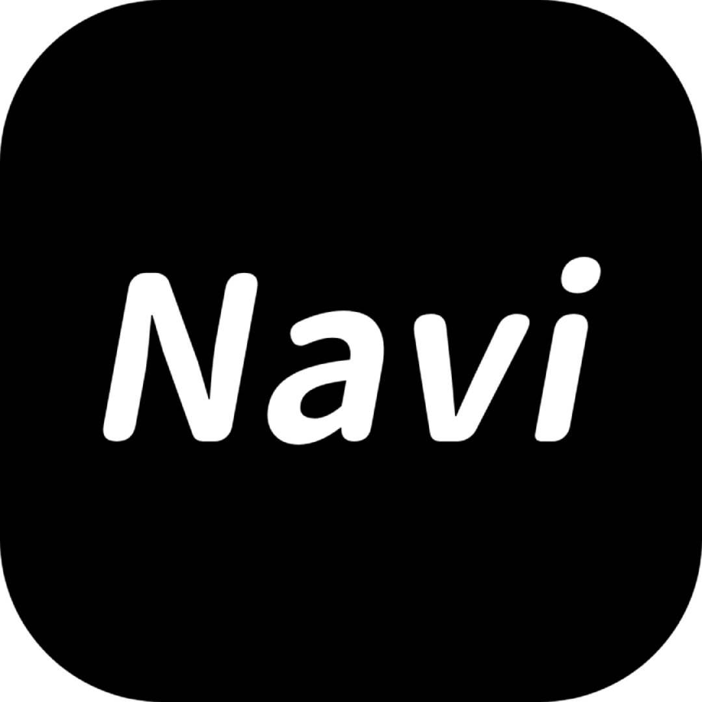

  

一个简洁优雅的导航应用，基于 Flutter 开发

## ✨ 特性

- 🔍 **网站收藏管理** - 便捷地管理您的网站收藏
- 📁 **分类整理** - 灵活的分类系统，让收藏更有条理
- 🚀 **快速访问** - 一键直达您的常用网站
- 📤 **数据导出** - 支持导出数据，方便备份
- 📥 **数据导入** - 轻松导入已有数据
- 🗄️ **本地存储** - 数据安全存储在本地
- 📱 **现代界面** - 简洁美观的卡片布局设计

## 🛠️ 技术栈

- **框架** - [Flutter](https://flutter.dev)
- **平台** - Windows & Android
- **开发工具** - [VS Code](https://code.visualstudio.com/) & [Android Studio](https://developer.android.com/studio)
- **AI 助手** - [Cursor](https://cursor.sh/)

## 📄 开源协议

- 本项目采用 [MIT 开源协议](LICENSE)。您可以自由使用、修改和分发，但需要保留原始版权和许可声明。

  

